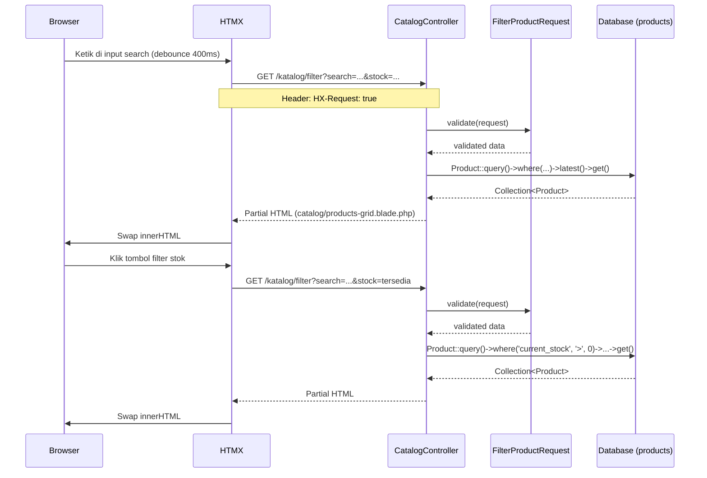
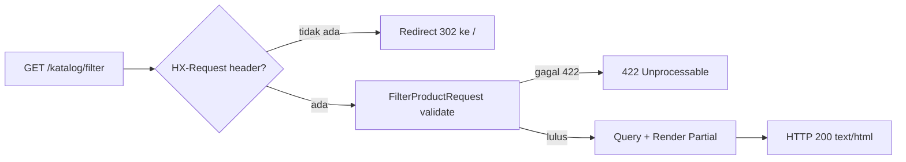

# Design Document — Katalog Publik Enhancement

## Overview

Fitur ini meningkatkan halaman katalog publik (`/`) pada dua area utama yang saling independen:

1. **Settings Hardening** — Menambahkan 5 key baru ke `config/settings.php` (address, email, instagram, gmaps_iframe, business_hours) dan menampilkan `business_hours` secara kondisional di section kontak.
2. **Search & Filter Produk via HTMX** — Menambahkan komponen `Product_Filter` yang memungkinkan pengunjung menyaring produk berdasarkan nama/deskripsi dan status stok secara real-time tanpa full page reload, menggunakan HTMX sebagai mekanisme transport tunggal.

Proyek berjalan di atas **Laravel 13 + BHA Stack** (Blade + HTMX + Alpine.js + Tailwind CSS). Arsitektur untuk fitur ini mengikuti pola `Controller → FormRequest` karena semua operasi bersifat read-only — tidak ada logika bisnis multi-tabel yang memerlukan Action/Service.

**Prinsip utama yang ditegakkan:**
- `declare(strict_types=1)` di setiap file PHP baru
- HTMX untuk semua interaksi server; Alpine.js hanya untuk active state visual client-side
- Query Eloquent via `where()` Builder — tidak menggunakan `filter()` pada Collection
- Mobile-first, dark mode support penuh, amber color scheme

---

## Architecture

### Komponen yang Terlibat

```
Browser
  │
  ├─► GET /                  ──► CatalogController@index
  │       └── catalog.blade.php (full page render)
  │               ├── catalog/partials/product-filter.blade.php (HTMX triggers)
  │               └── catalog/products-grid.blade.php (initial render)
  │
  └─► GET /katalog/filter    ──► CatalogController@filter
          ├── Catalog\FilterProductRequest (validasi search + stock)
          └── catalog/products-grid.blade.php (HTMX partial response)

Admin
  │
  └─► POST /settings         ──► SettingController@update
          └── Setting::updateOrCreate (business_hours + semua key lain)
```

### Diagram Alur Data



### Alur Redirect (Non-HTMX Request Guard)



---

## Components and Interfaces

### 1. `config/settings.php` (Dimodifikasi)

**Perubahan:** Menambahkan 5 key baru dalam blok `// Contact Information`.

```php
<?php

declare(strict_types=1);

return [
    // Business Identity
    'business_name'  => env('APP_BUSINESS_NAME', 'Rima Craft'),
    'business_phone' => env('APP_BUSINESS_PHONE', ''),

    // Contact Information
    'address'        => env('SETTINGS_ADDRESS', ''),
    'email'          => env('SETTINGS_EMAIL', ''),
    'instagram'      => env('SETTINGS_INSTAGRAM', ''),
    'gmaps_iframe'   => env('SETTINGS_GMAPS_IFRAME', ''),
    'business_hours' => env('SETTINGS_BUSINESS_HOURS', ''),
];
```

**Catatan:** Semua key yang ada saat ini di `SettingController@update` sudah membaca `business_hours` karena controller menggunakan loop `foreach ($data as $key => $value)` — tidak ada perubahan logika controller yang diperlukan, hanya penambahan input di view dan key di config.

---

### 2. `App\Http\Requests\Catalog\FilterProductRequest` (Baru)

**Path:** `app/Http/Requests/Catalog/FilterProductRequest.php`

**Tanggung jawab:** Memvalidasi dan membersihkan input parameter pencarian dan filter stok dari HTMX request.

```php
<?php

declare(strict_types=1);

namespace App\Http\Requests\Catalog;

use Illuminate\Foundation\Http\FormRequest;

class FilterProductRequest extends FormRequest
{
    public function authorize(): bool
    {
        return true; // endpoint publik
    }

    public function rules(): array
    {
        return [
            'search' => ['nullable', 'string', 'max:100', 'regex:/^[a-zA-Z0-9\s\-\.,?!]*$/'],
            'stock'  => ['nullable', 'string', 'in:semua,tersedia,habis'],
        ];
    }
}
```

**Catatan validasi:**
- `search`: nullable, max 100 karakter, hanya alfanumerik + spasi + `- . , ? !`
- `stock`: nullable, enum string `semua | tersedia | habis`; nilai null diperlakukan sebagai `semua`

---

### 3. `App\Http\Controllers\CatalogController` (Dimodifikasi)

**Perubahan:** Menambahkan method `filter()` baru. Method `index()` tidak berubah secara fungsional.

```php
<?php

declare(strict_types=1);

namespace App\Http\Controllers;

use App\Http\Requests\Catalog\FilterProductRequest;
use App\Models\Product;
use Illuminate\Http\RedirectResponse;
use Illuminate\View\View;

class CatalogController extends Controller
{
    public function index(): View
    {
        $products  = Product::latest()->get();
        $galleries = \App\Models\Gallery::orderBy('sort_order')->get();
        return view('catalog', compact('products', 'galleries'));
    }

    public function filter(FilterProductRequest $request): View|RedirectResponse
    {
        if (! $request->header('HX-Request')) {
            return redirect()->route('catalog.index');
        }

        $search = trim((string) ($request->validated('search') ?? ''));
        $stock  = $request->validated('stock') ?? 'semua';

        $query = Product::query()->latest();

        if ($search !== '') {
            $query->where(function ($q) use ($search): void {
                $q->where('name', 'like', "%{$search}%")
                  ->orWhere('description', 'like', "%{$search}%");
            });
        }

        if ($stock === 'tersedia') {
            $query->where('current_stock', '>', 0);
        } elseif ($stock === 'habis') {
            $query->where('current_stock', '<=', 0);
        }

        $products = $query->get();

        return view('catalog.products-grid', compact('products'));
    }
}
```

**Alasan desain:**
- Guard `HX-Request` header di dalam method (bukan middleware) agar tetap sederhana dan tidak mengotori middleware stack untuk satu endpoint publik.
- `FilterProductRequest` digunakan sebagai type-hint sehingga validasi berjalan otomatis sebelum logika query.
- Query menggunakan `where()` Builder, tidak `filter()` Collection, sesuai aturan teknis.

---

### 4. `routes/web.php` (Dimodifikasi)

**Perubahan:** Menambahkan satu route publik.

```php
Route::get('/katalog/filter', [CatalogController::class, 'filter'])
    ->name('catalog.filter');
```

---

### 5. Blade Views (Baru & Dimodifikasi)

#### 5a. `resources/views/catalog/products-grid.blade.php` (Baru — Partial View)

View ini merender hanya grid kartu produk, tanpa layout. Digunakan:
1. Sebagai **include** dari `catalog.blade.php` pada initial page load.
2. Sebagai **HTMX response** dari `CatalogController@filter`.

**Struktur HTML:**
```html
{{-- resources/views/catalog/products-grid.blade.php --}}
@if($products->isEmpty())
    <div class="col-span-full text-center py-16 ...">
        <p>Tidak ada produk yang sesuai.</p>
    </div>
@else
    @foreach($products as $product)
        {{-- Kartu produk (HTML identik dengan yang sudah ada di catalog.blade.php) --}}
    @endforeach
@endif
```

#### 5b. `resources/views/catalog/partials/product-filter.blade.php` (Baru — Komponen Filter)

Komponen ini berisi input pencarian dan tombol filter stok. Di-include dari `catalog.blade.php`.

**Atribut HTMX kunci:**
- Input search: `hx-get="/katalog/filter"`, `hx-target="#products-grid"`, `hx-trigger="keyup changed delay:400ms"`, `hx-include="closest form"`
- Tombol stok: setiap tombol adalah `<button type="submit" name="stock" value="semua|tersedia|habis">` di dalam form yang sama
- Loading state: `hx-indicator="#products-grid"` → kelas `htmx-request` pada `#products-grid` untuk opacity reduction

**Alpine.js scope:** Hanya mengelola `activeFilter` state untuk kelas CSS aktif/non-aktif — tidak ada state server di Alpine.

```html
{{-- resources/views/catalog/partials/product-filter.blade.php --}}
<form
    x-data="{ activeFilter: 'semua' }"
    hx-get="/katalog/filter"
    hx-target="#products-grid"
    hx-swap="innerHTML"
>
    {{-- Input Search --}}
    <input
        type="search"
        name="search"
        placeholder="Cari produk..."
        hx-trigger="keyup changed delay:400ms from:this"
        hx-include="closest form"
    />

    {{-- Tombol Filter Stok --}}
    @foreach(['semua', 'tersedia', 'habis'] as $filter)
        <button
            type="submit"
            name="stock"
            value="{{ $filter }}"
            @click="activeFilter = '{{ $filter }}'"
            :class="activeFilter === '{{ $filter }}'
                ? 'bg-amber-500 text-white'
                : 'bg-gray-100 dark:bg-gray-800 text-gray-700 dark:text-gray-300'"
            class="px-4 py-1.5 rounded-full text-xs font-bold uppercase tracking-widest transition-all"
        >
            {{ ucfirst($filter) }}
        </button>
    @endforeach
</form>
```

#### 5c. `catalog.blade.php` (Dimodifikasi — 2 area)

**Modifikasi 1: Section `#katalog`** — Menambahkan include Product_Filter sebelum grid, dan mengubah grid menjadi include ke partial.

```html
<section id="katalog" ...>
    <div ...>
        {{-- Header section tetap sama --}}

        {{-- BARU: Product Filter --}}
        @include('catalog.partials.product-filter')

        {{-- DIMODIFIKASI: Grid sekarang menggunakan partial dengan id target HTMX --}}
        <div id="products-grid" class="grid grid-cols-1 sm:grid-cols-2 lg:grid-cols-3 gap-8 [&.htmx-request]:opacity-50 [&.htmx-request]:transition-opacity">
            @include('catalog.products-grid', ['products' => $products])
        </div>
    </div>
</section>
```

**Modifikasi 2: Section `#kontak`** — Menambahkan blok jam operasional kondisional dan memperbaiki WhatsApp CTA.

```html
{{-- Di dalam blok kontak, setelah blok alamat --}}
@php
    $businessHours = trim((string) config('settings.business_hours', ''));
@endphp
@if($businessHours !== '')
    <div>
        <h4 class="text-xs font-bold uppercase tracking-widest text-gray-400 dark:text-gray-500 mb-2">
            Jam Operasional
        </h4>
        <p class="text-gray-700 dark:text-gray-300 font-light">{{ $businessHours }}</p>
    </div>
@endif

{{-- WhatsApp CTA yang diperbaiki --}}
@php
    $rawPhone = (string) config('settings.business_phone', '');
    $digitsOnly = preg_replace('/\D/', '', $rawPhone);
    if (str_starts_with($digitsOnly, '0')) {
        $digitsOnly = '62' . substr($digitsOnly, 1);
    }
    $formattedPhone = $digitsOnly;
@endphp
@if(strlen($formattedPhone) >= 10)
    <a
        href="https://wa.me/{{ $formattedPhone }}"
        target="_blank"
        rel="noopener noreferrer"
        aria-label="Chat WhatsApp dengan Rima Craft"
        class="inline-flex items-center gap-2 px-6 py-3 bg-[#25D366] hover:bg-[#128C7E] text-white font-bold rounded-xl ..."
    >
        Hubungi Kami
    </a>
@endif
```

#### 5d. `resources/views/settings/index.blade.php` (Dimodifikasi)

**Perubahan:** Menambahkan input `business_hours` di tab "Data Umum", di dalam blok "Informasi Kontak & Lokasi", setelah field `gmaps_iframe`.

```html
<div>
    <label class="block text-xs font-bold text-gray-700 dark:text-gray-300 mb-1">
        Jam Operasional
    </label>
    <input
        type="text"
        name="business_hours"
        value="{{ $settings['business_hours'] ?? '' }}"
        class="w-full px-3 py-2 text-sm rounded-md border border-gray-300 dark:border-gray-700 ..."
        placeholder="Contoh: Senin–Sabtu, 08.00–17.00 WIB"
    />
</div>
```

---

## Data Models

Tidak ada perubahan skema database. Semua fitur menggunakan model dan tabel yang sudah ada.

### Model yang Terlibat

| Model | Tabel | Penggunaan dalam Fitur |
|---|---|---|
| `Product` | `products` | Sumber data grid produk dan filter query |
| `Setting` | `settings` | Menyimpan `business_hours` dan key kontak lain |

### Perubahan pada `config/settings.php`

File konfigurasi adalah **array PHP statis** yang dibaca Laravel melalui `config('settings.*')`. Laravel membaca file ini sekali saat bootstrap, kemudian di-cache. Nilai runtime berasal dari tabel `settings` melalui mekanisme `Setting::pluck()` yang di-bind ke config di `AppServiceProvider` (atau via helper `config()` yang override default dengan nilai DB jika ada implementasi tersebut).

> **Catatan implementasi:** Pada kode saat ini, `catalog.blade.php` membaca `config('settings.address')` dll. yang berarti ada binding dari DB ke config yang harus diperiksa saat implementasi. Jika tidak ada `AppServiceProvider` override, view mungkin hanya membaca nilai default dari file PHP. Ini perlu diklarifikasi saat implementasi tasks.

### Query Filter Produk

Kolom yang digunakan dalam query filter:

| Kolom | Tipe | Filter |
|---|---|---|
| `name` | `varchar` | LIKE search (case-insensitive) |
| `description` | `text`, nullable | LIKE search (case-insensitive) |
| `current_stock` | `integer` | > 0 (tersedia), <= 0 (habis) |
| `deleted_at` | `timestamp`, nullable | SoftDeletes — otomatis dikecualikan |

---

## Correctness Properties

*A property is a characteristic or behavior that should hold true across all valid executions of a system — essentially, a formal statement about what the system should do. Properties serve as the bridge between human-readable specifications and machine-verifiable correctness guarantees.*

### Property 1: Filter Search Mengembalikan Subset yang Relevan

*For any* dataset produk dan string pencarian yang valid (1–100 karakter alfanumerik), semua produk yang dikembalikan oleh endpoint filter SHALL memiliki kolom `name` atau `description` yang mengandung string pencarian (case-insensitive). Tidak boleh ada produk yang dikembalikan yang tidak cocok dengan query.

**Validates: Requirements 3.3, 4.2, 4.3**

---

### Property 2: Filter Stok adalah Subset Invariant

*For any* dataset produk dan nilai filter stok aktif:
- Jika `stock = tersedia`, maka setiap produk `p` dalam hasil filter SHALL memiliki `p.current_stock > 0`
- Jika `stock = habis`, maka setiap produk `p` dalam hasil filter SHALL memiliki `p.current_stock <= 0`

Tidak boleh ada satu pun produk dalam hasil yang melanggar kondisi ini.

**Validates: Requirements 4.2, 4.3**

---

### Property 3: Filter Kombinasi adalah Irisan Dua Kondisi (Confluence)

*For any* dataset produk, string pencarian `s`, dan nilai filter stok `k`, hasil `filter(s, k)` SHALL setara dengan `filter_stock(k, filter_search(s, all_products))` maupun `filter_search(s, filter_stock(k, all_products))`. Urutan penerapan filter tidak mengubah hasil akhir.

**Validates: Requirements 3.5, 4.5**

---

### Property 4: Filter `semua` + Search Kosong Mengembalikan Semua Produk (Identity)

*For any* dataset produk, memanggil `filter('', 'semua')` SHALL mengembalikan jumlah produk yang sama dengan `Product::latest()->get()` tanpa kondisi apapun, dan tidak ada produk yang dikecualikan.

**Validates: Requirements 3.4, 4.4**

---

### Property 5: Response HTMX Selalu Fragment HTML (Invariant Format)

*For any* kombinasi valid `(search, stock)` dengan header `HX-Request: true`, response dari `GET /katalog/filter` SHALL:
- Memiliki HTTP status 200
- Memiliki `Content-Type: text/html`
- Tidak mengandung tag `<html>`, `<head>`, atau `<body>` (fragment murni)

**Validates: Requirements 5.4, 5.6**

---

### Property 6: Formatter Nomor WhatsApp Idempoten dan Invariant Prefix

*For any* string nomor telepon yang valid yang menghasilkan paling tidak 10 digit:
- `format_wa(format_wa(phone)) == format_wa(phone)` (idempoten — menerapkan formatter dua kali menghasilkan hasil yang sama)
- `str_starts_with(format_wa(phone), '62')` (invariant prefix — hasil selalu dimulai `62` setelah strip non-digit dan konversi leading `0`)

**Validates: Requirements 7.2**

---

### Catatan Konsolidasi Properties

Setelah property reflection:
- Properties 3.7 dan 4.8 (empty state message) dikonsolidasi ke dalam Property 1 dan 2 — jika tidak ada produk yang memenuhi kedua kondisi, Collection kosong dan view menampilkan pesan kosong.
- Properties 7.1 dan 7.3 (render/tidak render CTA) dikaver oleh Property 6 — jika format valid (>= 10 digit), CTA dirender; jika tidak, tidak ada CTA.
- Properties 1.6 dan 1.7 (settings save round-trip) tidak dimasukkan sebagai Correctness Property formal di sini karena lebih tepat sebagai integration test `SettingController` yang sudah ada, bukan property baru dari fitur ini.

---

## Error Handling

| Skenario | Respons |
|---|---|
| `GET /katalog/filter` tanpa header `HX-Request` | Redirect 302 ke `/` |
| Parameter `search` mengandung karakter tidak valid (di luar regex) | HTTP 422 (dari `FilterProductRequest`) |
| Parameter `stock` bukan `semua\|tersedia\|habis` | HTTP 422 (dari `FilterProductRequest`) |
| Kombinasi filter valid tapi 0 produk cocok | HTTP 200 + Partial_View dengan pesan "Tidak ada produk yang sesuai." |
| Error database saat `SettingController@update` | Laravel default exception handler → HTTP 500 (tidak ada perubahan state) |
| `config('settings.business_phone')` menghasilkan < 10 digit | Blok WhatsApp CTA tidak dirender (conditional `@if`) |
| `config('settings.business_hours')` kosong/whitespace | Blok jam operasional tidak dirender (conditional `@if`) |

---

## Testing Strategy

### Ringkasan Pendekatan

Fitur ini **sesuai untuk property-based testing** pada logika filter query dan formatter nomor telepon. Library yang digunakan: **[PHPUnit](https://phpunit.de/) + [Eris](https://github.com/giorgiosironi/eris)** (library PBT untuk PHP) atau alternatif menggunakan **custom data providers** dengan set data yang besar.

> **Alternatif yang lebih pragmatis** jika Eris tidak tersedia: gunakan **PHPUnit data providers** dengan set data yang di-generate (100+ kombinasi) menggunakan `array_map` dan `range`. Ini bukan PBT murni tapi mengcover input space yang representatif.

Minimum **100 iterasi** per property test.

### Unit Tests (Example-Based)

| Test | Yang Diverifikasi | Class |
|---|---|---|
| `CatalogControllerTest::it_redirects_non_htmx_requests` | Guard HX-Request → 302 | `Tests\Feature\CatalogControllerTest` |
| `CatalogControllerTest::it_returns_200_for_valid_htmx_requests` | Response 200 dengan header benar | `Tests\Feature\CatalogControllerTest` |
| `FilterProductRequestTest::it_rejects_invalid_stock_values` | Validasi enum stock | `Tests\Unit\FilterProductRequestTest` |
| `FilterProductRequestTest::it_rejects_search_with_special_chars` | Validasi regex search | `Tests\Unit\FilterProductRequestTest` |
| `CatalogViewTest::it_renders_filter_component_with_correct_attributes` | HTMX atribut pada input/form | `Tests\Feature\CatalogViewTest` |
| `CatalogViewTest::it_renders_business_hours_when_set` | Conditional rendering jam operasional | `Tests\Feature\CatalogViewTest` |
| `CatalogViewTest::it_hides_business_hours_when_empty` | Tidak render saat kosong/null | `Tests\Feature\CatalogViewTest` |
| `CatalogViewTest::it_renders_whatsapp_cta_with_valid_phone` | CTA render dengan href benar | `Tests\Feature\CatalogViewTest` |
| `CatalogViewTest::it_hides_whatsapp_cta_when_phone_invalid` | CTA tidak render saat < 10 digit | `Tests\Feature\CatalogViewTest` |
| `SettingsConfigTest::it_defines_all_contact_keys` | Keberadaan semua 5 key di config | `Tests\Unit\SettingsConfigTest` |

### Property-Based Tests

Setiap property test harus di-tag dengan komentar:
`// Feature: katalog-publik-enhancement, Property {N}: {teks property}`

#### **Property 1: Filter Search — Subset Invariant**

```
// Feature: katalog-publik-enhancement, Property 1: Filter search returns only matching products

Tag: Feature: katalog-publik-enhancement, Property 1
For any product dataset and any valid search string,
  ALL products returned by filter(search, 'semua')
  MUST contain the search string in name or description (case-insensitive)
Minimum iterations: 100
Input generators:
  - search: random string 1–100 chars from [a-zA-Z0-9 \-.,?!]
  - products: random list of 0–50 Product factory instances
```

#### **Property 2: Filter Stok — Subset Invariant**

```
// Feature: katalog-publik-enhancement, Property 2: Stock filter returns only matching products

Tag: Feature: katalog-publik-enhancement, Property 2
For any product dataset:
  - filter('', 'tersedia') → all p: p.current_stock > 0
  - filter('', 'habis')    → all p: p.current_stock <= 0
Minimum iterations: 100
Input generators:
  - products: random list of 0–50 Product factory instances
    dengan current_stock acak (termasuk 0 dan negatif)
```

#### **Property 3: Confluence Filter**

```
// Feature: katalog-publik-enhancement, Property 3: Filter order does not affect result

Tag: Feature: katalog-publik-enhancement, Property 3
For any (search, stock, products):
  count(filter(search, stock)) == count(filter_search(search, filter_stock(stock, all)))
Minimum iterations: 100
```

#### **Property 4: Identity Filter**

```
// Feature: katalog-publik-enhancement, Property 4: Empty filter returns all products

Tag: Feature: katalog-publik-enhancement, Property 4
For any product dataset:
  count(filter('', 'semua')) == count(Product::all())
  AND set(filter('', 'semua')) == set(Product::all())
Minimum iterations: 100
Input generators:
  - products: random list 1–50 Product factory instances
```

#### **Property 5: HTMX Response Format**

```
// Feature: katalog-publik-enhancement, Property 5: HTMX response is always a valid HTML fragment

Tag: Feature: katalog-publik-enhancement, Property 5
For any valid (search, stock) combination:
  response.status == 200
  AND response.headers['Content-Type'] contains 'text/html'
  AND response.body does NOT contain '<html', '<head', '<body'
Minimum iterations: 100
Input generators:
  - search: random valid string or empty string
  - stock: random pick from ['semua', 'tersedia', 'habis']
```

#### **Property 6: Formatter WhatsApp — Idempotence & Prefix Invariant**

```
// Feature: katalog-publik-enhancement, Property 6: WA phone formatter is idempotent with 62 prefix

Tag: Feature: katalog-publik-enhancement, Property 6
For any phone string that yields >= 10 digits:
  format_wa(format_wa(phone)) == format_wa(phone)  // idempoten
  AND str_starts_with(format_wa(phone), '62')       // prefix invariant
Minimum iterations: 100
Input generators:
  - phone: random strings including Indonesian formats:
    '08xx...', '+628x...', '628x...', strings with spaces/dashes
```

### Integration Tests

| Skenario | Deskripsi |
|---|---|
| `SettingController@update` saves `business_hours` | POST ke `/settings` dengan `business_hours`, verifikasi DB record |
| Full catalog page renders correctly | GET `/`, verifikasi semua section ada termasuk filter |
| Filter + Search combined request | GET `/katalog/filter?search=...&stock=tersedia`, verifikasi response |
